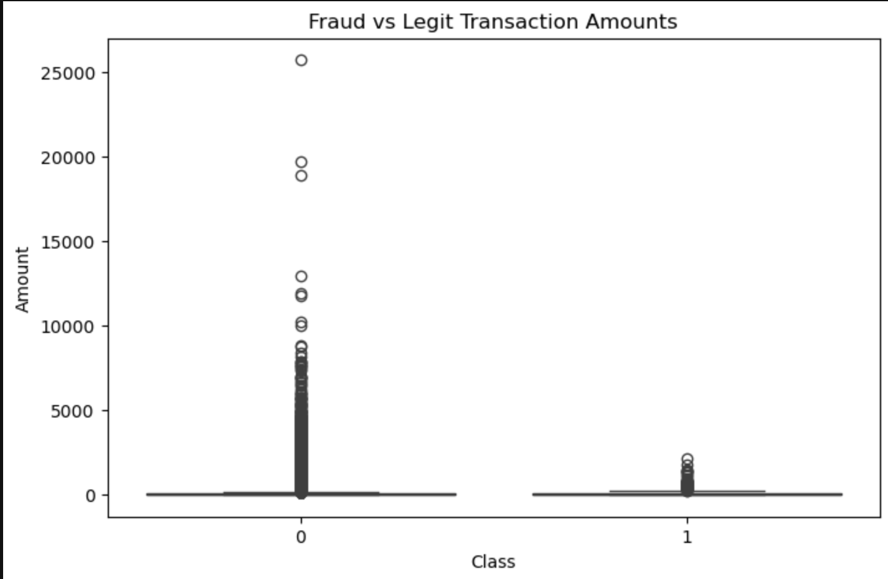
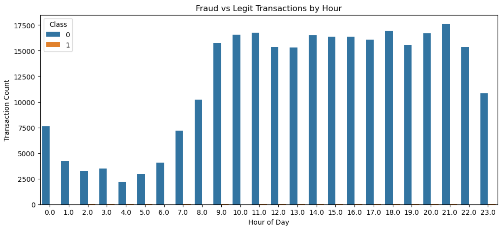
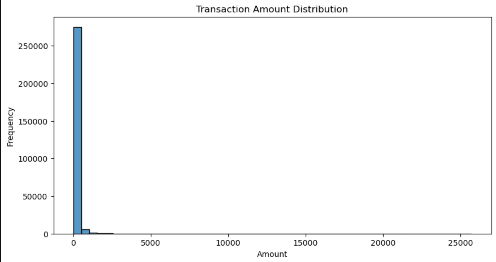
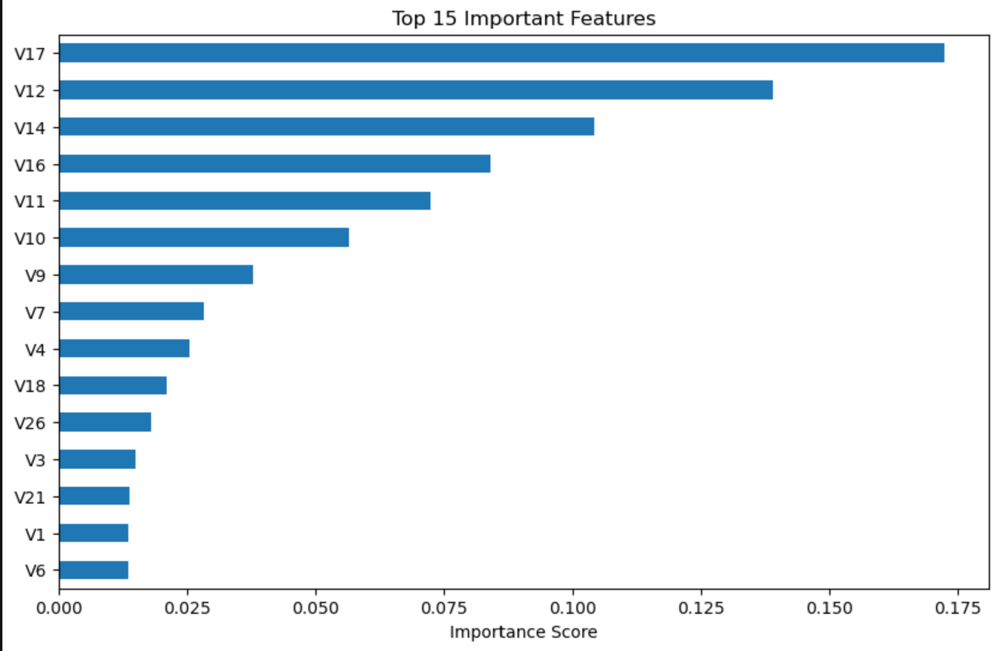
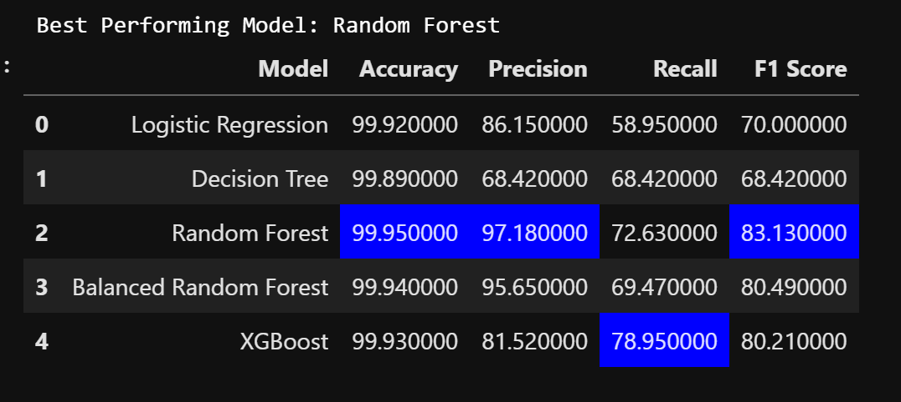

# 🛡️ FraudShield ML

### AI-Powered Credit Card Fraud Detection using Machine Learning

FraudShield is an end-to-end machine learning project designed to detect fraudulent credit card transactions from highly imbalanced financial data. The project combines data preprocessing, exploratory data analysis, feature engineering, and multiple classification models to identify suspicious transactions with high precision.

---

## 🚀 Highlights

* 📊 Processed **283,726+ financial transactions**
* 🧹 Removed **1,081 duplicate records**
* 🤖 Trained and compared **5 Machine Learning Models**
* 🎯 Achieved **99.95% Accuracy** and **97.18% Precision**
* 🔍 Performed feature importance analysis to identify key fraud indicators
* ⚖️ Addressed class imbalance through model experimentation

---

## 🛠️ Tech Stack

**Languages & Libraries**

Python • Pandas • NumPy • Matplotlib • Seaborn • Scikit-Learn • XGBoost

**Machine Learning Models**

* Logistic Regression
* Decision Tree
* Random Forest
* Balanced Random Forest
* XGBoost

---

## 📂 Dataset Overview

| Metric                  | Value   |
| ----------------------- | ------- |
| Original Records        | 284,807 |
| Records After Cleaning  | 283,726 |
| Legitimate Transactions | 283,253 |
| Fraudulent Transactions | 473     |
| Features                | 31      |

---

## 📈 Model Performance

| Model                  | Accuracy   | Precision  | Recall     | F1 Score   |
| ---------------------- | ---------- | ---------- | ---------- | ---------- |
| Logistic Regression    | 99.92%     | 86.15%     | 58.95%     | 70.00%     |
| Decision Tree          | 99.89%     | 68.42%     | 68.42%     | 68.42%     |
| 🏆 Random Forest       | **99.95%** | **97.18%** | 72.63%     | **83.13%** |
| Balanced Random Forest | 99.94%     | 95.65%     | 69.47%     | 80.49%     |
| XGBoost                | 99.93%     | 81.52%     | **78.95%** | 80.21%     |

---

## 🔍 Key Insights

* Random Forest delivered the best overall performance.
* XGBoost achieved the highest fraud detection recall.
* Transaction amount alone was not a strong fraud indicator.
* Features **V17, V12, V14, V16, and V11** contributed most to fraud prediction.
* Fraud detection requires balancing precision and recall due to severe class imbalance.

---

## 📊 Project Workflow

```text
Data Collection
      ↓
Data Cleaning
      ↓
Exploratory Data Analysis
      ↓
Feature Engineering
      ↓
Data Preprocessing
      ↓
Model Training
      ↓
Model Evaluation
      ↓
Feature Importance Analysis
```

---

## 📸 Project Visualizations

### Fraud vs Legit Transaction Amounts



### Fraud vs Legit Transactions by Hour



### Transaction Amount Distribution



### Feature Importance Analysis



### Model Comparison




## 🎯 Future Improvements

* Hyperparameter Tuning
* SMOTE Oversampling
* Real-Time Fraud Detection API
* Streamlit Dashboard
* Deep Learning Models

---

## 👨‍💻 Author

**Abhi Shah**

AI & Data Science Undergraduate
JECRC University, Jaipur

LinkedIn: [www.linkedin.com/in/abhi-shah-9974a3232](http://www.linkedin.com/in/abhi-shah-9974a3232)

GitHub: https://github.com/abhishah9784
